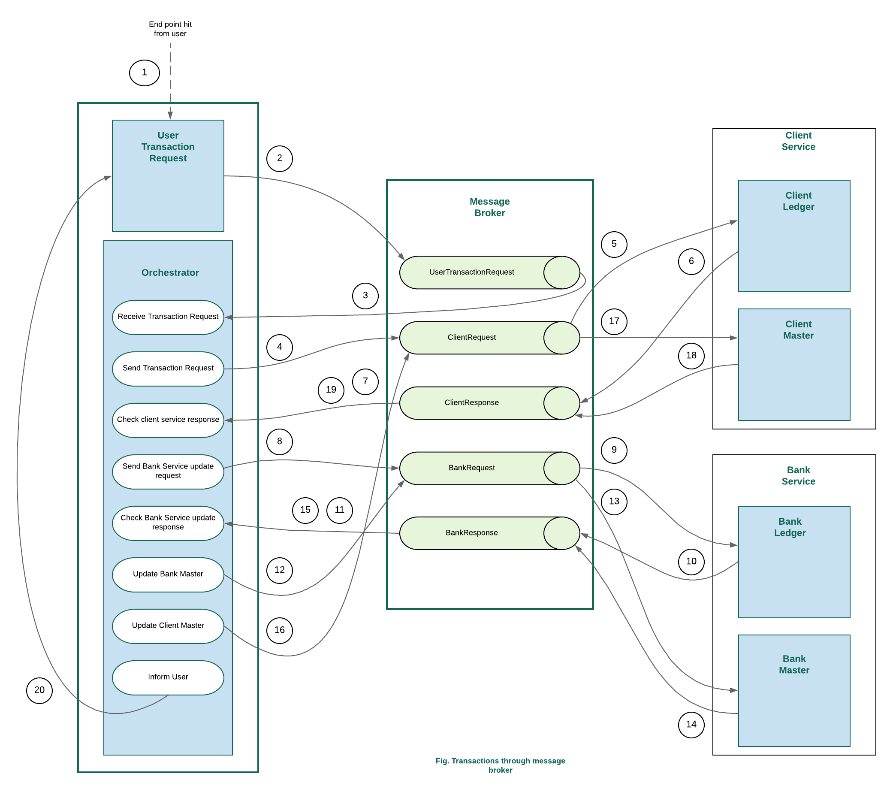

# SAGA Pattern| Implementing Distributed Transaction Using Microservices
In this article, we will show how to implement `Distributed Transaction` among microservices using `Saga Pattern`. For this purpose, we will try to cover the following,
* giving a basic concept of Distributed Transaction and Saga Pattern
* understanding sample business for a banking system 
* implementing a sample microservice based banking system using Spring boot
* implementing distributed transaction across multiple microservices using Saga Pattern
## Distributed Transaction
In a nutshell, Distributed Transaction is the transaction that span over multiple physical systems over the network. In microservice based system, handling transactions has been one of the biggest challenges. In a monolithic system, the whole service is built as a single unified unit with a single database. Unlike the monolithic system, a microservice architecture decomposes the whole system into multiple self-encapsulated services each of them having own database. As a result, a local transaction in the monolithic system becomes distributed into multiple services that are called in a sequence. 

### What is the problem?
In a monolith system, there is a single database that can maintain the `ACID property`(Atomicity, Consistency, Isolation and Durability). But in a microservice based architecture, as a single transaction can span over multiple databases, it becomes challenging to maintain the ACID property of databases.

### What is the solution?
1. `Two phase commit (2PC)` : 2PC handles every transaction in two phases, *Prepare Phase* & *Commit Phase*. *Transaction Coordinator* maintains the life cycle of transaction.
To understand 2PC architecture in detail you can [see here](https://medium.com/swlh/handling-transactions-in-the-microservice-world-c77b275813e0)
2. `SAGA Pattern` : A saga is a sequence of local transactions where each transaction updates data within a single service. The first transaction is initiated by an external request corresponding to the system operation, and then each subsequent step is triggered by the completion of the previous one.
SAGA is one of the best way to ensure the consistency of the data in a distributed architecture without having a single ACID transaction. SAGA commits multiple compensatory transactions at different stages ensuring to rollback when required.
Saga transaction can be implemented in different ways, but the two most popular ways are:

   * _Events/Choreography_: When there is no central coordination, each service produces and listen to other service’s events and decides if an action should be taken or not. 
   In the Events/Choreography approach, the first service executes a transaction and then publishes an event. This event is listened by one or more services which execute local transactions and publish (or not) new events.The distributed transaction ends when the last service executes its local transaction and does not publish any events or the event published is not heard by any of the saga’s participants.
   [Undersatnd Saga Choreography in detail from here](https://blog.couchbase.com/saga-pattern-implement-business-transactions-using-microservices-part/)
   * _Command/Orchestration_: When a coordinator service is responsible for centralizing the saga’s decision making and sequencing business logic.
   In the orchestration approach, we define a new service with the sole responsibility of telling each participant what to do and when. The saga orchestrator communicates with each service in a command/reply style telling them what operation should be performed.
   [Undersatnd Saga Orchestration in detail from here](https://blog.couchbase.com/saga-pattern-implement-business-transactions-using-microservices-part-2/)
   
## Implementing sample microservice based Banking System
We will now implement a sample microservice based banking system that provides deposit and withdraw services.
### Understanding the business logic
Our business contains three microservices, *User Request Service*, *Customer Service* and *Bank Service*.
Understand the business at a glance:

